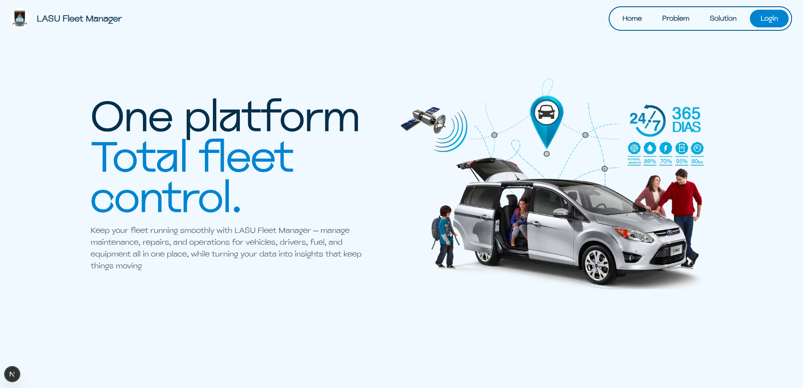

# LASU Fleet Manager



An advanced fleet management system designed to streamline vehicle operations, enhance tracking, and reduce operational costs. This platform provides real-time insights into maintenance schedules, fuel consumption, and vehicle status, ensuring optimal performance and accountability.

### The Problem

- 🔴 **Delayed Maintenance**: Vehicles break down due to poorly tracked maintenance schedules.
- 🔴 **Unchecked Expenses**: Repair and fuel costs go unchecked, risking budget overruns and misuse.
- 🔴 **Scattered Data**: Vehicle information is fragmented, making it difficult to get a complete operational picture.
- 🔴 **Slow Approvals**: Manual approval processes cause unnecessary and costly vehicle downtime.
- 🔴 **Inaccurate Records**: Incomplete fuel logs hide inefficiencies and potential fraud.

### The Solution

- 🟢 **Centralized Platform**: A single source of truth for all vehicle maintenance, fuel, and status updates in real time.
- 🟢 **Transparent Tracking**: Every expense is logged with a clear audit trail to ensure accountability.
- 🟢 **Instant Approvals**: Role-based access allows Owners, Managers, and Auditors to approve requests instantly.
- 🟢 **Predictive Insights**: Automated analytics predict maintenance needs, minimizing downtime and extending vehicle life.
- 🟢 **Anomaly Detection**: Accurate fuel monitoring matches usage with vehicle activity to flag anomalies fast.

## ✨ Key Features

- **Centralized Dashboard**: A comprehensive overview of all fleet activities, including maintenance requests, fuel logs, and vehicle conditions.
- **Real-Time Tracking**: Monitor vehicle status, location, and performance data in real-time.
- **Maintenance Management**: Schedule, track, and manage all vehicle maintenance activities to prevent breakdowns and minimize downtime.
- **Expense Monitoring**: Keep a detailed log of all expenses related to fuel and repairs with transparent audit trails.
- **Role-Based Access Control**: Secure access for different user roles (Owner, Manager, Auditor, Admin) with specific permissions.
- **Fuel Log Management**: Accurately track fuel consumption to identify inefficiencies and prevent fraud.

## 🛠️ Tech Stack

- **Framework**: [Next.js](https://nextjs.org/) 15
- **Language**: [TypeScript](https://www.typescriptlang.org/)
- **Styling**: [Tailwind CSS](https://tailwindcss.com/)
- **Authentication**: [NextAuth.js](https://next-auth.js.org/)
- **UI Components**: [Shadcn/UI](https://ui.shadcn.com/) (using Radix UI + Tailwind CSS)
- **Animations**: [GSAP](https://greensock.com/gsap/)
- **Linting**: [ESLint](https://eslint.org/)

## 🚀 Getting Started

Follow these instructions to get a copy of the project up and running on your local machine for development and testing purposes.

### Prerequisites

- [Node.js](https://nodejs.org/en/) (v20.x or later)
- [npm](https://www.npmjs.com/) or [yarn](https://yarnpkg.com/)

### Installation

1.  **Clone the repository:**
    ```bash
    git clone https://github.com/your-username/lasu-fleet-manager.git
    cd lasu-fleet-manager
    ```

2.  **Install dependencies:**
    ```bash
    npm install
    ```

3.  **Set up environment variables:**
    Create a `.env.local` file in the root of the project and add the following variables. You can use the `.env.example` as a template.
    ```env
    # The base URL for the backend API
    NEXT_PUBLIC_API_URL=https://your-api-url.com

    # NextAuth.js secret for JWT signing
    AUTH_SECRET=your-super-secret-auth-secret
    ```

### Running the Application

- **Development Mode:**
  ```bash
  npm run dev
  ```
  Open [http://localhost:3000](http://localhost:3000) to view it in the browser.

- **Production Build:**
  ```bash
  npm run build
  ```

- **Start Production Server:**
  ```bash
  npm run start
  ```

## 👥 User Roles and Access Levels

### 1. Administrator (Admin)
- **Access Level**: Full system access
- **Key Permissions**:
  - User account management
  - System configuration
  - Full data access and modification
  - Role assignment
  - Activity monitoring
- **Access Points**:
  - `/admin/*` - Full admin dashboard
  - `/api/*` - All API endpoints
  - `/manager` - Manager dashboard access

### 2. Manager
- **Access Level**: Operational management
- **Key Permissions**:
  - Vehicle assignment and tracking
  - Maintenance request approval
  - Fleet operation oversight
  - Report generation
- **Access Points**:
  - `/manager` - Manager dashboard
  - `/api/manager/*` - Manager-specific APIs
  - Limited access to admin features

### 3. Auditor
- **Access Level**: Read-only
- **Key Permissions**:
  - View system activities
  - Access audit logs
  - Generate compliance reports
  - No data modification rights
- **Access Points**:
  - `/audit` - Audit dashboard
  - Read-only access to relevant sections

### 4. Owner
- **Access Level**: Vehicle ownership
- **Key Permissions**:
  - View owned vehicles
  - Track maintenance history
  - Monitor vehicle status
  - Limited modification rights
- **Access Points**:
  - `/owners` - Owner dashboard
  - Vehicle-specific endpoints

### 5. Standard User
- **Access Level**: Basic
- **Key Permissions**:
  - Submit maintenance requests
  - Log fuel consumption
  - View assigned vehicles
  - Check schedules
- **Access Points**:
  - Limited to personal dashboard
  - Restricted API access

## 📋 User Manual

### Account Setup
1. **First-Time Login**
   - Use the credentials provided by your administrator
   - Change your password on first login
   - Set up two-factor authentication (recommended)

2. **Dashboard Overview**
   - Quick view of assigned vehiclesmanager_page
   - Pending approvals
   - Maintenance alerts
   - Recent activities

### Vehicle Management
1. **Adding a Vehicle**
   - Navigate to Vehicles > Add New
   - Fill in vehicle details (VIN, make, model, year)
   - Upload necessary documents
   - Assign to appropriate department/owner

2. **Scheduling Maintenance**
   - Select vehicle from dashboard
   - Click "Schedule Maintenance"
   - Choose maintenance type (routine, repair, inspection)
   - Set priority and estimated completion date

### Reporting Issues
1. **Creating a Maintenance Request**
   - Go to Maintenance > New Request
   - Select vehicle and issue type
   - Provide detailed description
   - Attach photos if available
   - Submit for approval

2. **Fuel Logging**
   - Access Fuel Logs > New Entry
   - Select vehicle and driver
   - Enter odometer reading and fuel amount
   - Upload receipt (required for reimbursement)
   - Submit for verification

## 🔒 Security Guidelines

### Account Security
- Use strong, unique passwords
- Never share login credentials
- Log out after each session

### Data Privacy
- Access only the data necessary for your role
- Do not download or share sensitive information
- Follow company data handling policies
- Report any data breaches immediately

## 📜 Available Scripts

In the project directory, you can run:

- `npm run dev`: Runs the app in development mode with Turbopack.
- `npm run build`: Builds the app for production.
- `npm run start`: Starts the production server.
- `npm run lint`: Lints the codebase using ESLint.

## 📂 Project Structure

- **/src/app**: Contains all the pages and API routes for the application.
- **/src/components**: Shared UI components used across the application.
- **/src/lib**: Utility functions and library configurations.
- **/src/hooks**: Custom React hooks for state management and logic.
- **/public**: Static assets like images and fonts.

## 🗺️ Routing

The project follows the Next.js App Router structure. Here are the main routes available:

### Application Routes

- `/`: Home page
- `/login`: User login page
- `/dashboard`: Admin dashboard
- `/auditors`: View all auditors (Admin)
- `/users`: View all users (Admin)
- `/users/create`: Create a new user (Admin)
- `/vehicles`: View all vehicles (Admin)
- `/manager`: Manager dashboard
- `/owners`: Owner dashboard

### API Routes

#### Audit Endpoints
- `GET /api/audit`
  - Fetches audit logs
  - Query params: `type`, `userId`, `startDate`, `endDate`
- `POST /api/audit`
  - Creates a new audit log entry
  - Required body: `{ action: string, entity: string, entityId: string, details?: object }`

#### Maintenance Endpoints
- `GET /api/maintenance`
  - Fetches maintenance requests
  - Query params: `ownerId`, `status`, `vehicleId`
- `POST /api/maintenance`
  - Creates a new maintenance request
  - Required body: `{ vehicle_id: string, owner_id: string, issue: string, priority: 'low' | 'medium' | 'high' }`
- `PATCH /api/maintenance?id=<id>`
  - Updates a maintenance request
  - Query param: `id` - Maintenance request ID
  - Body: Update fields

#### Manager Endpoints
- `GET /api/manager`
  - Fetches manager dashboard data
- `POST /api/manager`
  - Performs manager-specific actions
  - Body: Action-specific data

#### Owner Endpoints
- `GET /api/owners`
  - Fetches all owners or a specific owner's data
  - Query params: `id`, `email`
- `POST /api/owners`
  - Creates a new owner
  - Required body: Owner details
- `PUT /api/owners`
  - Updates owner role
  - Required body: `{ id: string, role_id: number }`
- `DELETE /api/owners`
  - Deletes an owner
  - Required body: `{ id: string }`

#### Vehicle Endpoints
- `GET /api/vehicles`
  - Fetches vehicles
  - Query params: `id`, `status`, `ownerId`
- `POST /api/vehicles`
  - Creates a new vehicle
  - Required body: Vehicle details
- `PUT /api/vehicles`
  - Updates a vehicle
  - Required body: `{ id: string, ...updates }`
- `DELETE /api/vehicles`
  - Deletes a vehicle
  - Required body: `{ id: string }`

---

## 📄 License

This project is licensed under the MIT License. See the `LICENSE` file for details.
